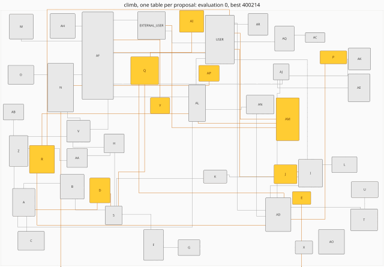

# cjitter: four stochastic searches in C, with uniform sampling as the control

### It warns when a search does no better than uniform random sampling at the same budget

You supply a fitness function over a box of real variables, lower being better, a budget in
evaluations, and, for hard constraints, a repair callback that moves a proposal into
feasibility before it is scored. One call optimizes it:

    cjitter_problem p = { n, lo, hi, my_fitness, my_repair, ctx, start };
    cjitter_budget  b = { 8000, 1 };           /* evaluations, seed */
    cjitter_result  r = { 0 };                 /* zero it; x is the one field you set */
    r.x = best;                                /* your array of n doubles */
    cjitter_run("climb", &p, &b, &r);

`start` is the point climb and anneal score first and the ga carries as member 0, or NULL
for the uniform draw every method used before it existed; random ignores it.

No dependencies beyond libm. Deterministic from a seed, byte for byte, on every platform.
`make lib` builds `libcjitter.a`; `make install` puts it and the one header under PREFIX.

Four methods spend the budget, and the comparison between them is the library's second half:

    random    draw uniformly from the box. The control.
    climb     jitter a neighbour, keep it if better, restart when stuck.
    anneal    the same, but accept a worse neighbour with a probability that decays.
    ga        population, tournament selection, blend crossover, jittered mutation.

    make
    ./labels          # 90 rectangles in a container, minimise overlap
    ./erd             # place new tables on an existing diagram; about a minute

## The control

Most optimisation libraries will spend a million evaluations and never mention that uniform
sampling would have done as well. `cjitter_compare` runs all four methods at the same budget
on the same seeds and reports, per method, the median, the range, the per-seed wins against
the control, and the exact one-sided sign-test probability of that many wins under a fair
coin. "better" is declared only when that probability is at or under 5% after Holm correction
across the methods compared, since testing three of them against one control at 5% each
would otherwise call one of three null methods better about 14% of the time; the raw sign-p
is printed beside the corrected one. "not shown" is a failure to demonstrate improvement, not a
finding of equality.

The same panel is available as numbers rather than a table. `cjitter_compare_raw` hands back
the score and the returned point of every run, `cjitter_compare_masked` runs only the methods
a mask names, and `cjitter_sign_p` and `cjitter_holm` are the two tests the verdict column is
made of, so a study pooling many instances uses them rather than writing them again. The sign
test carries its sum with an exact power-of-two scale, so a pooled panel of thousands of
pairs is as safe as a seed panel of seven; [example/metaphors](example/metaphors/README.md)
is such a study, 1200 pairs per cell over another benchmark's million runs.

On the label problem, at 36% area coverage:

    method         median        range    wins    sign-p      holm   vs random
    random        189.166      35.3242       -         -         - the control
    climb         12.8278       39.717    7/7    0.00781    0.0234      better
    anneal        127.625      35.4232    7/7    0.00781    0.0234      better
    ga            1.38243      3.55264    7/7    0.00781    0.0234      better

That table moves the whole vector on every proposal. `./labels 90 20000 7 2` moves one
label at a time, the `block` the library is named after, and all three searches reach
exactly 0 on all seven seeds, the clean layout none of them finds above.

The control has already earned its keep once. The first GA shipped here mutated at a fixed
scale, and the table read "no better than uniform sampling at equal cost"; an outside review
traced that verdict to the fixed scale, and with the mutation decaying the same GA is the
best method on the problem. Both halves of that story are the library working as intended.

## What this gives that reaching for scipy, nlopt or R does not

- **The control lives in the API.** `scipy.optimize`, nlopt, R's `optim`, `GA`, `DEoptim`
  hand back their own best number; none runs uniform sampling at the same budget beside your
  method. Here that comparison, with an exact paired verdict, is one call.
- **Exact statistics instead of a mean table.** Paired seed panels, the exact one-sided sign
  test, a declared 5% line, and a "not shown" that is never read as "equal".
- **Byte reproducibility across platforms.** Trajectories use integer arithmetic, `+ - *`,
  `fabs` and `sqrt`, and nothing else from libm, so a run reproduces from its seed on any
  compiler and architecture, and the test suite pins every number in these documents.
- **The number a noisy objective can stand behind.** The smallest value a search observes is
  the luckiest draw it took, and how much luck that carries differs by method. Set `verify`
  in the tuning and the result carries `verified`, the mean of that many fresh evaluations
  of the returned point, with `inflation` the gap; `cjitter_compare` then judges on it.
  [docs/tuning.md](docs/tuning.md) has the measurement that forced this field.
- **Every method constant is a caller-visible field, read literally**, so `ga_mutate = 0` is
  a real mutation ablation, `ga_crossover = 0` a real crossover ablation, and a comparison
  names its tuning. `block`, the number of variables one proposal moves, is the field worth
  knowing first: on objectives that are sums over weakly interacting objects it can be worth
  an order of magnitude in budget, and it is the mechanism the library is named after.
- **Two source files, C99, no dependencies.** It builds anywhere.

The fit is any problem whose objective is cheap enough to call thousands of times over tens
to a few hundred variables, with no gradient on offer:

    placement and packing        labels, diagrams, floor plans, sensors, nesting
    calibration, inverse design  small branchy models, controller gains, cheap evaluators
    constants inside programs    thresholds and knobs tuned against a fast benchmark,
                                 hyperparameters of quick-to-train models
    permutations by random keys  ordering, assignment, small routing
    falsification                searching a program's input box for the distance to failure
    allocation under a repair    portfolio and budget weights the repair normalizes
    black-box fitting            game evaluation weights against an opponent suite,
                                 simulation likelihoods

Where it does not fit: objectives costing minutes (those want surrogate models), losses with
usable gradients, dimensions in the thousands.

## The examples

**`example/labels/`** places rectangles in a container with minimum overlap: the problem the
author solved for industry in 2001, deployed, as per-label random unit steps kept when the
summed overlap fell. Staying inside the container is a hard constraint in the repair
callback; the reason it is not a penalty term is at the `cjitter_repair` typedef in `cjitter.h`.

**`example/erd/`** is the application this library was written for: tables added by a
database migration, placed onto a frozen diagram whose other 34 tables a person already knows.
The graph is a real anonymized production schema, and the objective routes every connector
orthogonally before reading it, which is what none of the published pinning implementations
do, then prices every crossing a reader sees at one connector of the diagram's mean length,
room at the maintainer's own clearance, and each connector at its length squared. A
2,000-draw null in that directory shows the maintainer's own placement separable from a
random draw by nothing but not overlapping, so this demonstrates the library on a real graph
and is not a benchmark for an objective. The film is climb settling the migration, one table
per proposal, captioned by the crossings and the connector length under tables as they fall.
It ends at 26 crossings on screen, where the same router draws the maintainer's own
placement with 36, and fourteen of fifteen seeds end there:

[example/erd/README.md](example/erd/README.md) has the full walkthrough: both edge models,
the measured tables, the calibration lines, the null, and what the block does to each
method.

**`example/diagrams/`** turns the instrument around. Instead of descending an energy to
place objects, it starts from where a person placed them, 853 hand-drawn pathway and process
diagrams, and asks of each aesthetic criterion whether any small move of any box would lower
it. People draw at a minimum of overlap and nowhere near one of uniform edge length or
stress; what holds their boxes and the standard energy omits is alignment.
[example/diagrams/README.md](example/diagrams/README.md) has the table; the paper, *What
Holds a Hand-Drawn Diagram?*, is
[articles/cjitter](https://github.com/Anode1/articles/tree/main/cjitter),
[doi:10.5281/zenodo.22313827](https://doi.org/10.5281/zenodo.22313827).

**`example/metaphors/`** points the two verdict tests at somebody else's benchmark: the
1.4-million-run GECCO 2024 study of the metaphor optimization libraries, which ranked 296
implementations and computed no statistical test. Paired with random search per function,
instance and repetition from the benchmark's own released data, 66 to 98 implementations
per dimension are not shown better than uniform sampling at the top budget, most of them
strictly worse, and the count worse than random grows with budget. The audit is
pre-registered, and its whole verdict table is one 20-second program run. The audit is
withdrawn as a paper; the verdict tables stay here.
[example/metaphors/README.md](example/metaphors/README.md) has the pipeline.

## Build and test

    make            build both examples
    make lib        libcjitter.a; make install puts it and cjitter.h under PREFIX
    make check      ut + cliut, the commit gate
    make ut         unit suite: refusals, the exact budget, determinism, box and repair
    make cliut      black-box: the built examples through a shell, exit codes and reproducibility
    make ut-asan    both suites under AddressSanitizer
    make ut-ubsan   both suites under UBSan
    make pedantic   -pedantic -Wextra over every source; must be clean
    make clean

CI runs everything on Linux and macOS, six compiler/flag pairs, and a job that builds four
ways and compares both examples' output byte for byte; `AGENTS.md` states the exact coverage
and its limits.

## Going deeper

- [docs/tuning.md](docs/tuning.md): the tuning fields, the block, and the verify story.
- [docs/objective.md](docs/objective.md): how to build an objective a search can follow, and
  the repair defect that taught this repository its hardest lesson.
- [example/erd/README.md](example/erd/README.md): the diagram application in full.
- `c/cjitter.h` is the specification; the comments there are normative.

## See also

- [linearr](https://github.com/Anode1/linearr): least squares in C, reporting when a line is the
  wrong shape.
- [bpnn](https://github.com/Anode1/bpnn): a backpropagation network for the tables where it is,
  reporting when not to trust the fit.

## License

BSD 2-Clause; see `LICENSE`.
