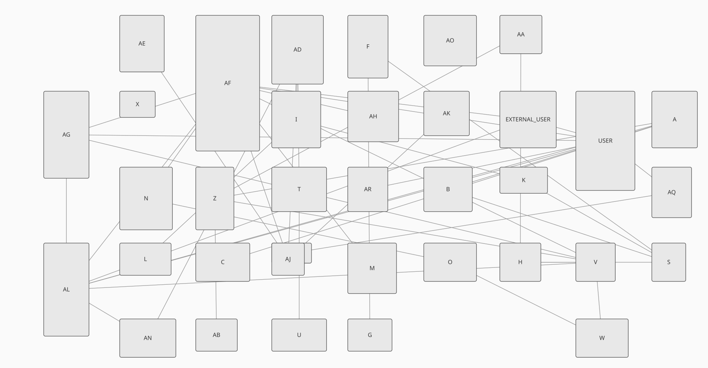
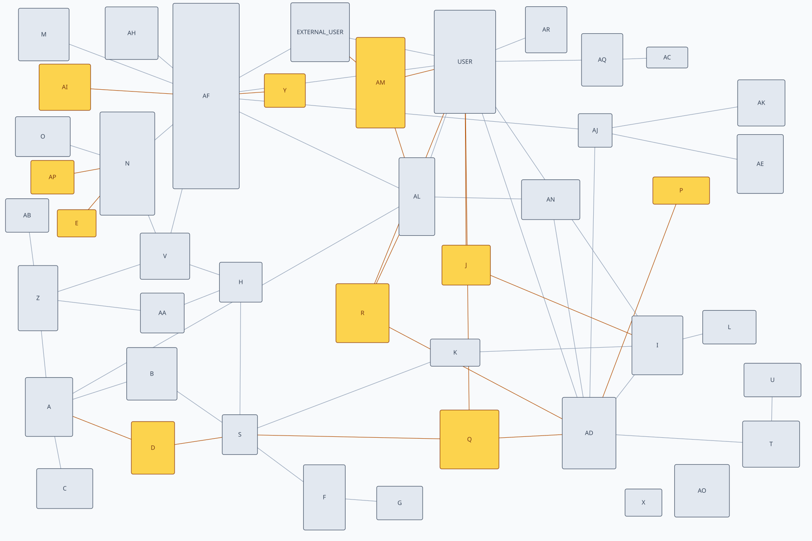

# cjitter: four stochastic searches in C, with uniform sampling as the control

### It warns when a search does no better than uniform random sampling at the same budget

You supply a fitness function over a box of real variables, lower being better, and a budget in
evaluations. Four methods spend that budget:

    random    draw uniformly from the box. The control.
    climb     jitter a neighbour, keep it if better, restart when stuck.
    anneal    the same, but accept a worse neighbour with a probability that decays.
    ga        population, tournament selection, blend crossover, jittered mutation.

    make
    ./labels          # 90 rectangles in a container, minimise overlap
    ./erd             # place new tables on an existing diagram

No dependencies beyond libm. Deterministic from a seed.

## Why the control is the point

Most optimisation libraries will spend a million evaluations and never mention that uniform
sampling would have done as well. `cjitter_compare` runs all four methods at the same budget over
several seeds and reports which beat the control, where "beat" means the method's median is better
than the control's luckiest seed. Anything short of that is inside the luck.

On the label problem, at 36% area coverage:

    method         median       spread  vs random
    random        187.046      22.2028 the control
    climb         15.3685      44.6581     better
    anneal        121.731      77.3957     better
    ga            195.553      6.59542  no better

The GA is no better than uniform sampling at equal cost. That is the sort of thing this library
exists to say, and it said it on the first run.

## The examples

**`example/labels.c`** places rectangles in a container with minimum overlap. This is the
problem the author solved for industry in 2001, deployed: label placement in a bounded area,
no edges between them, nothing allowed to intersect. Cheap, exact, deterministic objective;
hard constraint (stay inside) enforced by clamping in the repair callback rather than by a
penalty term, so it can never be traded against the objective.

**`example/erd/`** is the application this was written for. Laying out a diagram with the
fewest edge crossings is NP-complete (Garey and Johnson, *Crossing Number is NP-Complete*,
SIAM J. Algebraic Discrete Methods 4:312-316, 1983), so a polynomial-time exact algorithm
exists for nobody unless P = NP, and every drawing tool runs heuristics. MySQL Workbench's
heuristics do it badly, every reverse-engineering of the schema scrambles the positions, and
restoring this 44-table diagram by hand after each one cost the author about an hour. That
recurring hour is the problem this example solves.

The graph is real: an anonymized production schema -- 44 tables, 59 foreign-key edges on the
diagram, in the layout a person maintained by hand across migrations (`example/erd/data/`,
provenance and anonymization in `data/PROVENANCE.md`). The last migration added ten tables. The
observation that makes the problem tractable: only those ten need placing. Freezing the rest is
not a compromise for tractability -- a reader who knows where a table sits should still find it
there -- and it turns 88 free variables into 20.

Both revisions are in the repository, drawn by `data/render.py` from the extracted geometry.
Neither image is a Workbench export; an export would carry the real names. The diagram before
the migration:

and after it, the ten added tables in amber:

    34 tables already placed, 10 added by a migration, 59 foreign keys.

    centroid         251673   (place each new table at its neighbours' centroid)
    human            231877   (where the human actually put them)

    method         median       spread  vs random
    random         233513      78056.9 the control
    climb          109221      67136.9     better
    anneal         172069       106754     better
    ga             127781        16608     better

All three searches beat the control, the heuristic loses -- placing a table at its neighbours'
centroid drops it on top of the edges running between them -- and the searches also beat the
layout the human actually accepted, roughly halving its score. Read that last result carefully:
it says the human was optimizing things this objective cannot see -- semantic grouping, the
matching row heights, room to grow -- not that the tool lays out diagrams better than a person.
An objective is a specification, and this one specifies only crossings, penetrations and length.
The shipped layout is pinned digit for digit by `tests/cli.sh` on every run.

`./erd --svg > erd.svg` draws the three states stacked: the centroid heuristic, the search's
answer, and the human's accepted layout, the frozen 34 identical in all three. The picture is
the scores made visible.

## The objective

The tiers in the ERD example are worth copying. Edges passing through a table are scored by the
*length of the segment inside the rectangle*, not by a count: a count is flat under small moves, so
the search has nothing to follow and walks at random on the plateau. Crossings stay a count, at a
weight two orders of magnitude above edge length, so ties break toward a tidy diagram without any
weight having been guessed.

Node overlap and canvas bounds are hard constraints in the repair callback. A hard constraint
enforced by construction cannot trade itself off against the objective, and no infeasible point can
be returned as the best.

## Build and test

    make            build both examples
    make check      ut + cliut -- the commit gate
    make ut         unit suite: refusals, the exact budget, determinism, box and repair
    make cliut      black-box: the built examples through a shell, exit codes and reproducibility
    make ut-asan    both suites under AddressSanitizer
    make ut-ubsan   both suites under UBSan
    make pedantic   -pedantic -Wextra over every source; must be clean
    make clean

CI is three separate jobs, not a cross-product: the full battery on Linux and macOS with each
platform's default compiler; `make check` across gcc-12/gcc-13/clang at `-O0` and `-O2` on
Linux; and a reproducibility job that builds four ways -- two compilers, `-O0` and
`-O2 -march=native` -- and compares both examples' output byte for byte.

`-ffp-contract=off` is in the flags: a run must reproduce from its seed on another compiler and
another architecture, and gcc contracts `a*b+c` into one FMA by default even under `-std=c99`.
For the same reason no search trajectory calls libm beyond `sqrt`, the one function IEEE
requires to be correctly rounded: the gaussian step is a sum of uniforms, anneal's schedule and
acceptance use the library's own arithmetic `exp`, and the examples measure length with `sqrt`
rather than `hypot`. One ulp of libm disagreement under an argmax is a different answer.

## Status

Working library, two examples, both suites and CI. The ERD example's graph is the real schema,
carried as data (`example/erd/data/`): an anonymized `.mwb`, both revisions rendered to PNG,
and the extracted geometry as JSON. A C reader for `.mwb` files is not written -- the format is
a zip around `document.mwb.xml`; the figure positions live in `workbench.physical.TableFigure`
objects (`type="real" key="left"` -- attribute order matters when grepping), foreign keys in
`db.mysql.ForeignKey` objects whose `owner` link names the child table.

## See also

- [linearr](https://github.com/Anode1/linearr): least squares in C, which says when a line is the
  wrong shape.
- [bpnn](https://github.com/Anode1/bpnn): a backpropagation network for the tables where it is,
  which says when not to trust the fit.

## License

BSD 2-Clause; see `LICENSE`.
