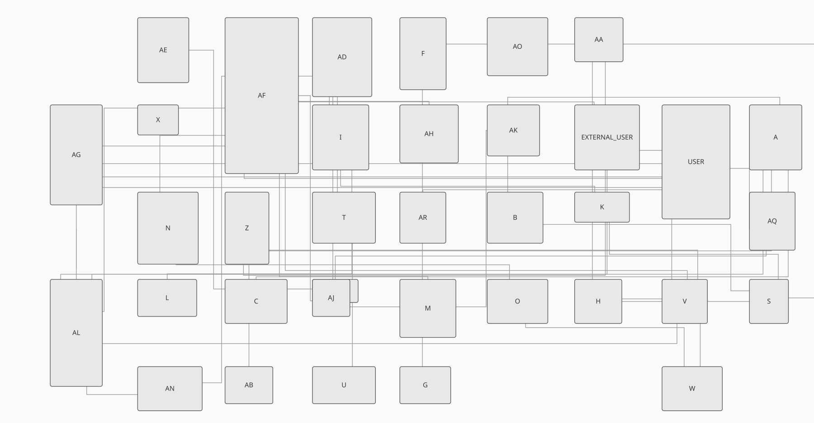
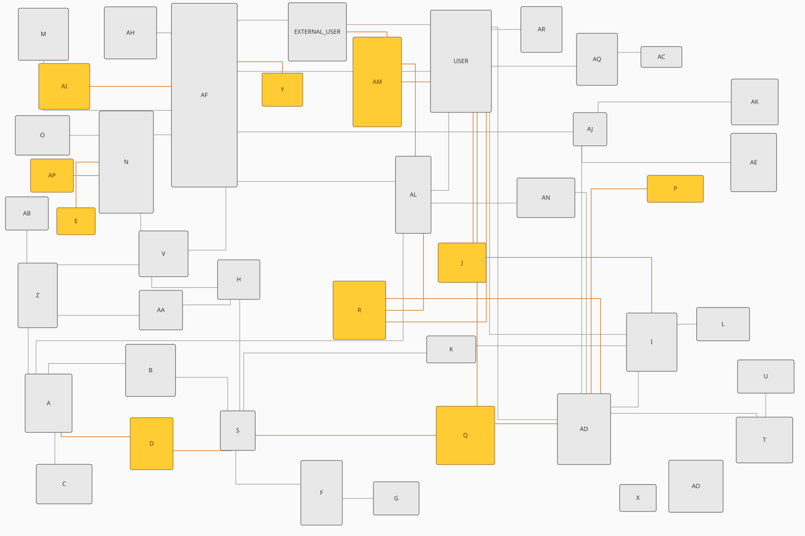
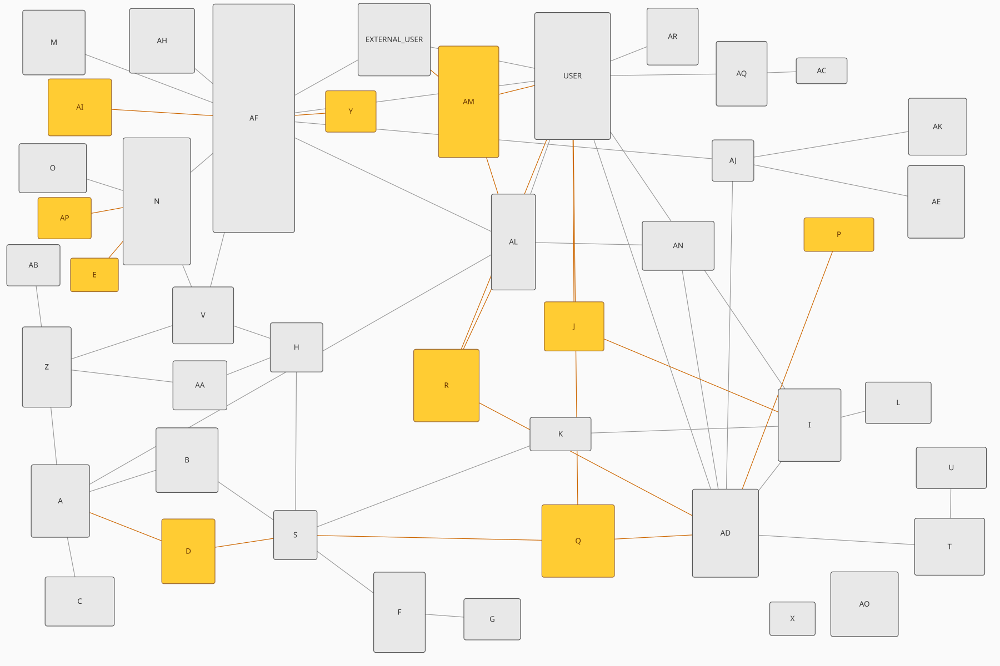

# The diagram example: a real schema's migration, placed into a frozen drawing

Laying out a diagram with the fewest edge crossings is NP-complete (Garey and Johnson,
*Crossing Number is NP-Complete*, SIAM J. Algebraic Discrete Methods 4:312-316, 1983), so
there is no polynomial-time exact algorithm unless P = NP, and every drawing tool runs
heuristics. MySQL Workbench's heuristics do it badly, every reverse-engineering of the
schema scrambles the positions, and restoring this 44-table diagram by hand after each one
cost the author about an hour. That recurring hour is the problem this example solves.

The graph is real: an anonymized production schema, 44 tables and the 59 foreign-key edges on
its diagram (`data/`, provenance and anonymization in `data/PROVENANCE.md`). The last
migration added ten tables. The observation that makes the problem tractable: only those ten
need placing. Freezing the rest is no compromise, since a reader who knows where a table sits
should still find it there, and it turns 88 free variables into 20.

## The film

The search itself is worth watching. The film is a smoothed replay of climb's improvements
at the shipped budget and seed, with `block` set to 2: the frozen diagram stands still, the
migration's ten tables glide from the first random draw into their neighbourhoods, and the
connectors re-route at every frame. `make movie` rebuilds it.

The block is why the film is watchable, and the reason is worth stating. At the default
block, one proposal moves all ten tables at once, so a proposal that seats one table beside
its neighbour usually unseats another and is rejected for it: the run accepts 42 proposals
out of 8000 and each one displaces the whole migration, which reads as ten tables
teleporting together. At `block` 2 the same climb accepts 158, each moving one table, and
finishes 31 percent lower (32428 against 46665). What the film shows is what the objective
was always asking for and the proposal shape could not express.

Both revisions are in the repository, drawn by `data/render.py` from the extracted geometry.
Neither image is a Workbench export; an export would carry the real names. The diagram before
the migration:

and after it, the ten added tables in amber:

## Two edge models, one boolean

There are two ways to draw an edge, and the example runs its whole experiment under each,
toggled by one boolean in the code. The straight diagonal segment is the general-graph
representation, and it is what surprisingly rich tools draw for ERDs; the orthogonal routed
connector, an L or a Z with the middle segment sliding across the channel the way a person
nudges a connector past an obstacle, is what Workbench draws and what a reader sees. The
same current revision, drawn with straight edges this time; the routed drawing of it is just
above:

Each edge model is calibrated against the one certain fact about the human's layout: it
achieved zero crossings and zero edges under a table on screen. The straight model charges
that clean screen 20 crossings and 1944 penetration; the routed model 27 and 323. Every
score means only as much as its calibration line, and the run prints both:

    34 tables already placed, 10 added by a migration, 59 foreign keys.

    ---- straight diagonal edges ----

    centroid         215066   (the centroid rule: each new table at its neighbours' centroid)
    human            218207   (the human placement, where the maintainer put them)
               20 crossings, 1943.96 penetration under this edge model

    method         median        range    wins    sign-p   vs random
    random         235567      39777.5       -         - the control
    climb         90661.2        57623    5/5     0.0312      better
    anneal         127730      72009.9    5/5     0.0312      better
    ga            72070.3        14062    5/5     0.0312      better

    ---- orthogonal routed connectors ----

    centroid         187368   (the centroid rule: each new table at its neighbours' centroid)
    human            157552   (the human placement, where the maintainer put them)
               27 crossings, 323 penetration under this edge model

    method         median        range    wins    sign-p   vs random
    random        80747.1      31356.4       -         - the control
    climb         46317.4      4584.05    5/5     0.0312      better
    anneal        47725.2      5057.59    5/5     0.0312      better
    ga            38565.5         6006    5/5     0.0312      better

Those are the default tuning's numbers, one proposal moving all twenty variables. `./erd
--block 2` moves one table per proposal instead and reports, under the routed model:

    method         median        range    wins    sign-p   vs random
    random        80747.1      31356.4       -         - the control
    climb         32572.2      1791.87    5/5     0.0312      better
    anneal        32916.8      2128.04    5/5     0.0312      better
    ga            53003.4      18528.4    5/5     0.0312      better

Read the range column beside the medians. Climb's median falls 30 percent and its spread over
five seeds falls from 4584 to 1792, so the blocked search returns much the same layout
whichever seed it is given, which in a tool run once is worth as much as the median. The
genetic algorithm is the exception and it is not a bug: only its mutation is blocked while
crossover still blends every coordinate, so a narrow block leaves it a weak-mutation GA. On
the label problem the same change is decisive rather than incremental: `./labels 90 20000 7 2`
puts climb, annealing and the GA all at exactly 0 on all seven seeds, the clean layout none
of them reaches at any budget with whole-vector proposals.

All three searches beat the control on every seed under both models, and the heuristic loses
under both: a table at its neighbours' centroid lands on the connectors running between its
neighbours. Read the human rows through the calibration lines: most of the human's score in
each section is that edge model failing to reproduce their real connectors, which is why even
the control's median outscores them in the routed section. The comparison that survives is
the feasibility pair. The routed seed-1 search layout reaches 0 penetration and 48 crossings
(23 at block 2); the human's routes to 323 and 27. Each is winning a different half of what
the tool and the person jointly achieved as 0 and 0, and closing that gap is the router's
open problem, not the search's. Connectors leave a table's border at that edge's own
attachment point, spread by the table's degree, so no two connectors ever share a segment:
an edge joins two tables and nothing else.

Each section ends with the layout one run at seed 1 found and its feasibility under that
model, pinned digit for digit by `tests/cli.sh`. `./erd --svg > erd.svg` draws four states
stacked with their actual routes: the scramble a reverse-engineering leaves (the state that
used to cost the hour), the centroid initial, the search's final, and the human's reference,
the frozen 34 identical in the last three. `--svg-straight` draws the same four with straight
edges.

The general lessons this example taught, tiering, scoring the medium, and the repair defect
that shipped infeasible layouts for a year, are collected in
[docs/objective.md](../../docs/objective.md).

## The data, and the .mwb format

The graph is carried as data (`data/`): an anonymized `.mwb`, both revisions rendered to PNG,
and the extracted geometry as JSON. A C reader for `.mwb` files is not written. The format is
a zip around `document.mwb.xml`; the figure positions live in `workbench.physical.TableFigure`
objects (the attribute order is `type="real" key="left"`, which matters when grepping),
foreign keys in `db.mysql.ForeignKey` objects whose `owner` link names the child table.
